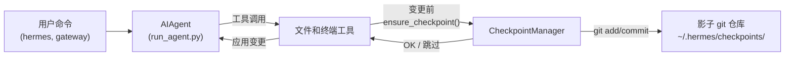

# 检查点与 `/rollback`

Hermes Agent 在**破坏性操作**前自动快照你的项目，并允许你通过一条命令恢复。检查点**默认启用**——当没有文件变更工具触发时成本为零。

这个安全网由内部的**检查点管理器**驱动，它在 `~/.hermes/checkpoints/` 下维护一个单独的影子 git 仓库——你的真实项目 `.git` 永远不会被触及。

## 什么会触发检查点

检查点会在以下情况前自动创建：

- **文件工具** —— `write_file` 和 `patch`
- **破坏性终端命令** —— `rm`、`mv`、`sed -i`、`truncate`、`shred`、输出重定向（`>`）和 `git reset`/`clean`/`checkout`

代理每个轮次每个目录**最多创建一个检查点**，因此长时间运行的会话不会产生大量快照。

## 快速参考

| 命令 | 描述 |
|------|------|
| `/rollback` | 列出所有检查点及变更统计 |
| `/rollback <N>` | 恢复到检查点 N（同时撤销最后一轮聊天） |
| `/rollback diff <N>` | 预览检查点 N 与当前状态之间的差异 |
| `/rollback <N> <file>` | 从检查点 N 恢复单个文件 |

## 检查点的工作原理

从高层来看：

- Hermes 检测到工具即将**修改**工作树中的文件。
- 每个对话轮次（每个目录）一次，它会：
  - 为文件解析一个合理的项目根目录。
  - 初始化或重用一个与该目录关联的**影子 git 仓库**。
  - 暂存并提交当前状态，附带简短、人类可读的原因。
- 这些提交形成一个检查点历史，你可以通过 `/rollback` 查看和恢复。



## 配置

检查点默认启用。在 `~/.hermes/config.yaml` 中配置：

```yaml
checkpoints:
  enabled: true          # 主开关（默认：true）
  max_snapshots: 50      # 每个目录的最大检查点数
```

禁用：

```yaml
checkpoints:
  enabled: false
```

禁用后，检查点管理器为空操作，永远不会尝试 git 操作。

## 列出检查点

在 CLI 会话中：

```
/rollback
```

Hermes 响应一个格式化的列表，显示变更统计：

```text
📸 /path/to/project 的检查点：

  1. 4270a8c  2026-03-16 04:36  before patch  (1 个文件, +1/-0)
  2. eaf4c1f  2026-03-16 04:35  before write_file
  3. b3f9d2e  2026-03-16 04:34  before terminal: sed -i s/old/new/ config.py  (1 个文件, +1/-1)

  /rollback <N>             恢复到检查点 N
  /rollback diff <N>        预览检查点 N 以来的变更
  /rollback <N> <file>      从检查点 N 恢复单个文件
```

每个条目显示：

- 短哈希
- 时间戳
- 原因（触发快照的原因）
- 变更摘要（变更的文件数、插入/删除数）

## 使用 `/rollback diff` 预览变更

在决定恢复之前，预览自检查点以来发生了什么变化：

```
/rollback diff 1
```

这显示 git diff 统计摘要，然后是实际的 diff：

```text
test.py | 2 +-
 1 个文件变更, 1 次插入(+), 1 次删除(-)

diff --git a/test.py b/test.py
--- a/test.py
+++ b/test.py
@@ -1 +1 @@
-print('original content')
+print('modified content')
```

长 diff 限制为 80 行以避免淹没终端。

## 使用 `/rollback` 恢复

按编号恢复到检查点：

```
/rollback 1
```

在后台，Hermes：

1. 验证目标提交存在于影子仓库中。
2. 对当前状态创建一个**回滚前快照**，以便你稍后可以"撤销撤销"。
3. 恢复工作目录中跟踪的文件。
4. **撤销最后一轮对话**，使代理的上下文与恢复的文件系统状态匹配。

成功时：

```text
✅ 已恢复到检查点 4270a8c5: before patch
已自动保存回滚前快照。
(^_^)b 已撤销 4 条消息。已移除："现在更新 test.py 为..."
  历史中剩余 4 条消息。
  聊天轮次已撤销以匹配恢复的文件状态。
```

对话撤销确保代理不会"记住"已回滚的变更，避免在下一轮产生混淆。

## 单文件恢复

从检查点恢复单个文件，不影响目录的其余部分：

```
/rollback 1 src/broken_file.py
```

当代理修改了多个文件但只需要撤销一个时很有用。

## 安全和性能保护

为了保持检查点安全和快速，Hermes 应用了几个保护措施：

- **Git 可用性** —— 如果 `PATH` 中找不到 `git`，检查点会被透明禁用。
- **目录范围** —— Hermes 跳过过于宽泛的目录（根目录 `/`、主目录 `$HOME`）。
- **仓库大小** —— 超过 50,000 个文件的目录会被跳过以避免缓慢的 git 操作。
- **无变更快照** —— 如果自上次快照以来没有变更，检查点会被跳过。
- **非致命错误** —— 检查点管理器内的所有错误都以调试级别记录；你的工具继续运行。

## 检查点存储位置

所有影子仓库位于：

```text
~/.hermes/checkpoints/
  ├── <hash1>/   # 一个工作目录的影子 git 仓库
  ├── <hash2>/
  └── ...
```

每个 `<hash>` 从工作目录的绝对路径派生。在每个影子仓库内你会找到：

- 标准 git 内部文件（`HEAD`、`refs/`、`objects/`）
- 一个 `info/exclude` 文件，包含策划的忽略列表
- 一个 `HERMES_WORKDIR` 文件，指回原始项目根目录

你通常永远不需要手动操作这些。

## 最佳实践

- **保持检查点启用** —— 它们默认开启，当没有文件修改时成本为零。
- **恢复前使用 `/rollback diff`** —— 预览将要变更的内容以选择正确的检查点。
- **使用 `/rollback` 代替 `git reset`**，当你只想撤销代理驱动的变更时。
- **与 Git 工作树结合** 以获得最大安全性——将每个 Hermes 会话保持在自己的工作树/分支中，检查点作为额外层。

有关在同一仓库上并行运行多个代理的信息，请参见 [Git 工作树](./git-worktrees.md)指南。
